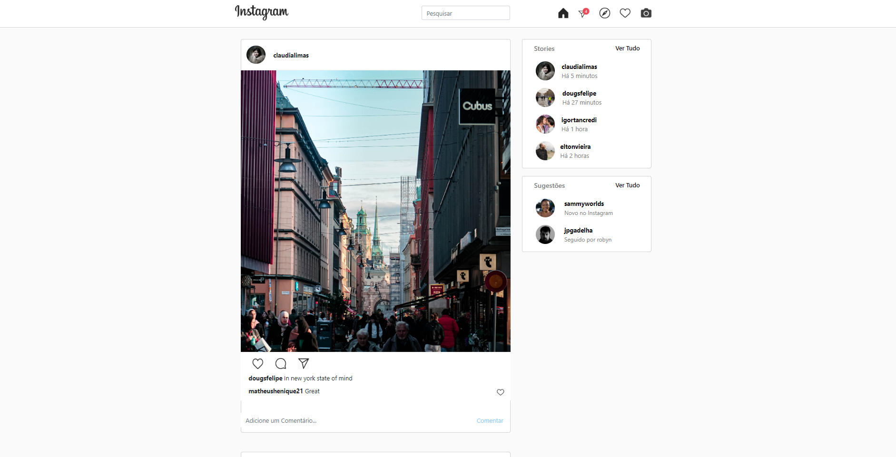

# Instagram Clone

##Instagram clone made using NodeJS and Mongodb

## For run

`'git clone https://github.com/dougsfelipe/Instagram-Clone.git'`  
`'npm install'`  
on api folder   `'nodemon server'`  
on cliente_web folder   `'nodemon app'`  
`'mongod.exe'`  
`'mongo.exe'`  

application on localhost:80

